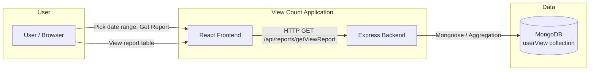
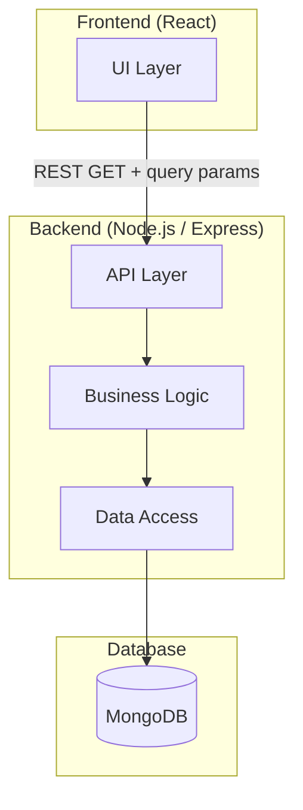
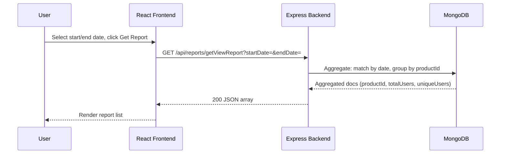
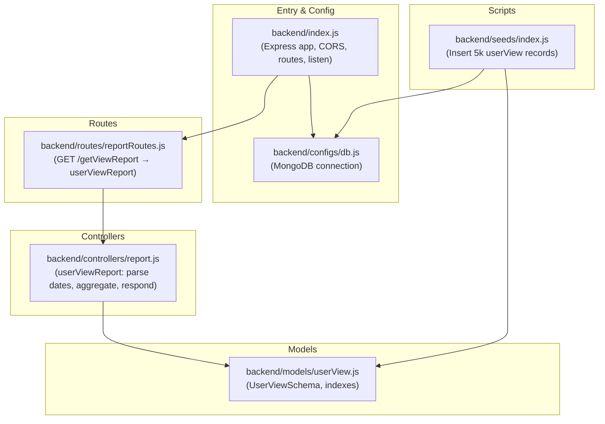
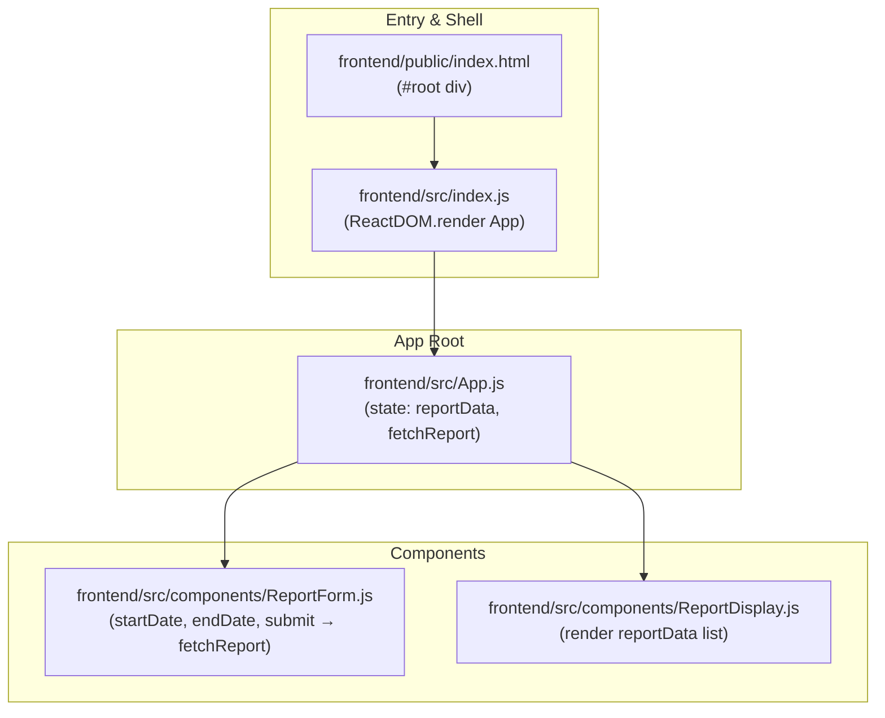
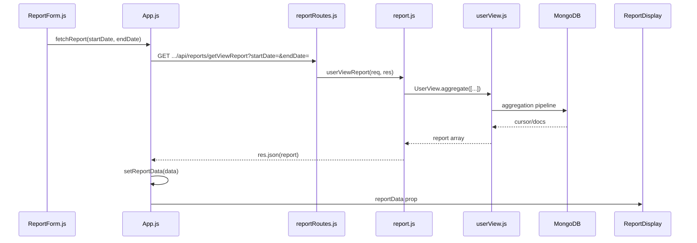
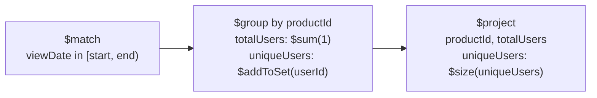

# View Count — High-Level & Low-Level Design

## 1. High-Level Design (HLD)

### 1.1 System Context



### 1.2 Component Overview



### 1.3 Request Flow (HLD)



### 1.4 HLD — Deployment / Runtime

```mermaid
flowchart TB
    subgraph Client["Client"]
        Browser[Browser]
    end
    subgraph Server["Server"]
        ReactDev[React Dev Server\n(e.g. port 3000)]
        Express[Express Server\nport 8100]
    end
    subgraph DataStore["Data Store"]
        Mongo[(MongoDB\nlocalhost:27017/reports)]
    end
    Browser --> ReactDev
    Browser --> Express
    Express --> Mongo
```

---

## 2. Low-Level Design (LLD)

### 2.1 Backend — File-Level Structure



### 2.2 Frontend — File-Level Structure



### 2.3 LLD — Request Path with Filenames



### 2.4 LLD — Aggregation Pipeline (report.js)



| Stage   | Purpose |
|--------|---------|
| `$match`  | Filter documents by `viewDate` (startDate ≤ viewDate < endDate). |
| `$group`  | Group by `productId`; count rows (`totalUsers`), collect distinct `userId` (`uniqueUsers` array). |
| `$project`| Expose `productId`, `totalUsers`, and replace `uniqueUsers` array with its size. |

### 2.5 LLD — File Reference Table

| Layer        | Responsibility                    | Filename |
|-------------|------------------------------------|----------|
| **Backend** |                                    |          |
| Entry       | Express app, middleware, server    | `backend/index.js` |
| Config      | MongoDB connection                 | `backend/configs/db.js` |
| Routes      | Mount GET /getViewReport           | `backend/routes/reportRoutes.js` |
| Controller  | Parse query, run aggregation, send | `backend/controllers/report.js` |
| Model       | userView schema and indexes       | `backend/models/userView.js` |
| Seed        | Populate userView collection      | `backend/seeds/index.js` |
| **Frontend**|                                    |          |
| Shell       | HTML root                          | `frontend/public/index.html` |
| Entry       | React mount                        | `frontend/src/index.js` |
| App         | State + fetch + layout             | `frontend/src/App.js` |
| Form        | Date inputs + submit               | `frontend/src/components/ReportForm.js` |
| Display     | Report list / empty message        | `frontend/src/components/ReportDisplay.js` |

---

## 3. Data Model (LLD)

### userView collection (backend/models/userView.js)

| Field      | Type   | Description           |
|-----------|--------|-----------------------|
| `userId`  | String | Viewer identifier     |
| `productId` | String | Product identifier  |
| `viewDate`  | Date  | When the view occurred |

**Indexes:** `{ userId: 1 }`, `{ productId: 1 }`

### API response shape (from backend/controllers/report.js)

| Field        | Type   | Description                    |
|-------------|--------|--------------------------------|
| `productId` | string | Product id from $group _id     |
| `totalUsers`| number | Total view events in range    |
| `uniqueUsers` | number | Count of distinct userIds   |

---

*Generated for the view_count repository.*
